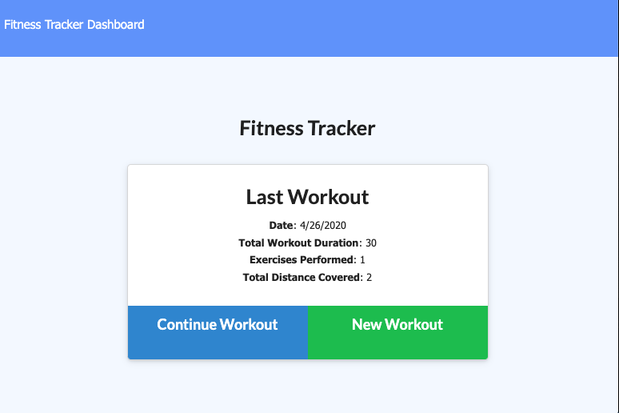

# Workout-Tracker
[](http://unlicense.org/)

## Description

This app allows you to view, create, and track daily workouts. You can log multiple exercies in a workout on a given day. You can track the name, type, weight, sets, reps, and duration of exercise. If the exercise is a cardio exercise, you can also track your distance traveled.

## Table of Contents

* [Installation](#installation)

* [Usage](#usage)

* [License](#license)

* [Contributing](#contributing)

* [Tests](#tests)

* [Screenshot](#screenshot)

* [Questions](#questions)

## Installation

To install the necessary dependencies, run the following command:

```
npm install
```

## Usage

Once installed, you will need to seed the database with some default data. Use `npm run seed` to accomplish this.

## License

This project is licensed under the None license.

## Contributing

Send me a PR and I'll look it over.

## Tests

To run tests, please run the following command:

```
N/A
```

## Screenshot



## Questions


If you have any questions about the repo, open an issue or contact [zackapotamus](https://api.github.com/users/zackapotamus) at [zack.hayden@gmail.com](mailto:zack.hayden@gmail.com).

